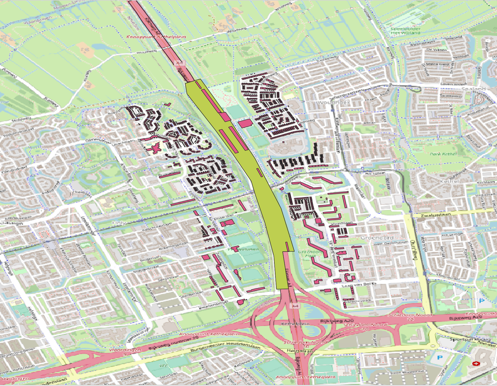
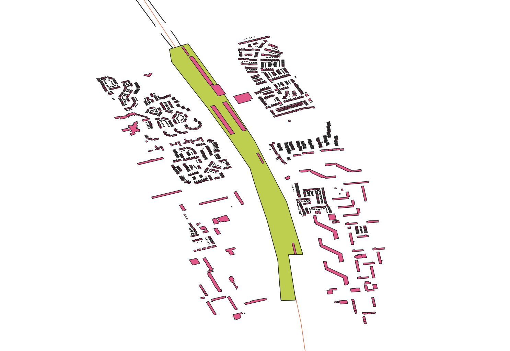
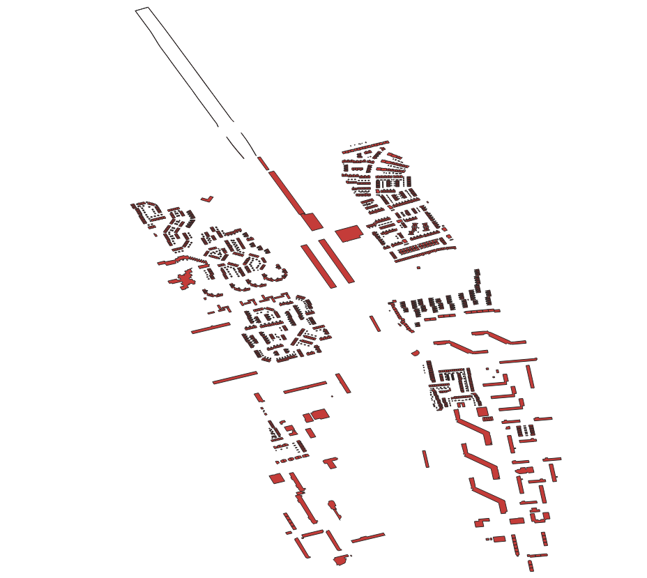
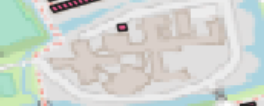

# UrbanRoadMap
This repository contains the code and results of the Turnel influence Building mapping


## Requirements

### Environment

1. Python 3.7.*
2. pandas
3. geopandas
4. fiona
5. overpass
6. shapely

### Install
Create a  virtual environment and activate it.
```shell
conda create -n tunnel python=3.7
conda activate tunnel
conda install geopandas
```


### Dataset
To evaluate the proposed code, you will need to prepared required datasets as the folder structure shows bellow. The provided road vector shape file and tunnel vector shape file are stored in highway and tunnel folder respectively, and the final extracted results are saved in the final_buildings folder.


```Shell
├── yuan_proj
    ├── highway
    ├── tunnel
    ├── final_buildings

```

### Extraction results




Results are shown in three different ways, with OSG background, with only provided road and tunnel shape files and only extracted building polygons. All the results are visualized in QGIS.


### Positive Building Search strategies
Three steps for the architecture search:

#### 1. using overpass api get the useful information from OSM  
```function
simple_osm_gdf
```
#### 2. determine the influence buffer from the provided tunnel shape file
```function
tunnel_buffer
```
#### 3. extract the building polygon location and find the intersects between the OSM building polygon and the expanded tunnel buffer
```function
building_gdf_way['geometry']
building_gdf_target
```

### Visual qualitive shortcomes


Some of complexed polygons are miss extracted as shown in the picture, when traceback to the osm, the overpass api can not extract the building polygon from this parts, so still has some improvements can be done.

### Acknowledgment
```
If you have any questions please find contacts Dr. Yuan at: milowei304@gmail.com
}
```
